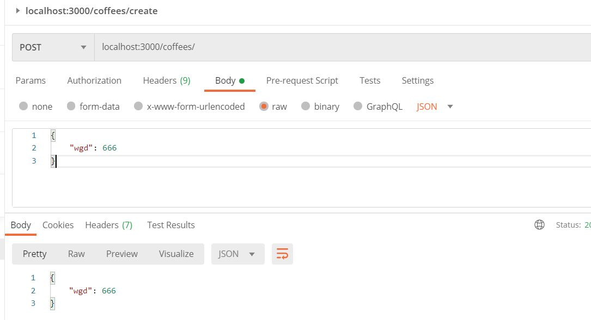
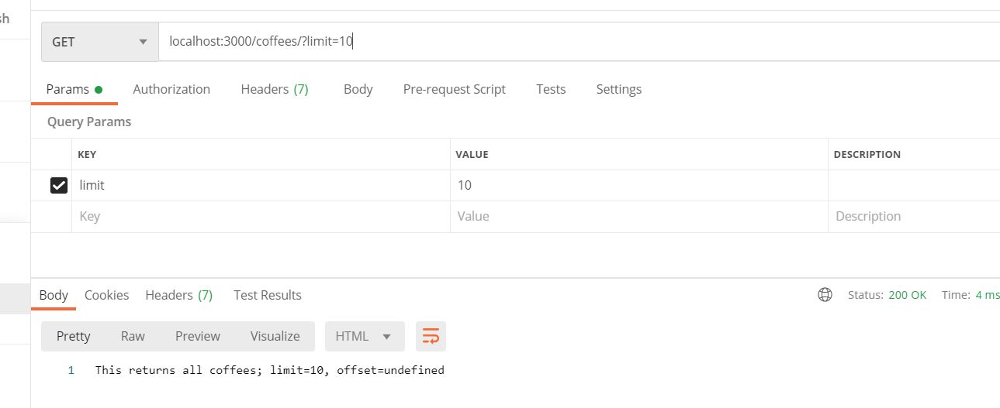
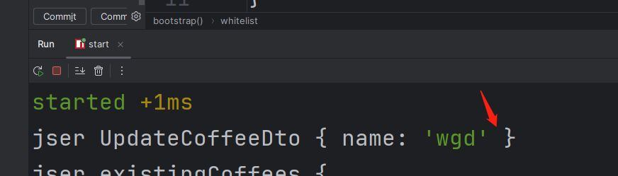
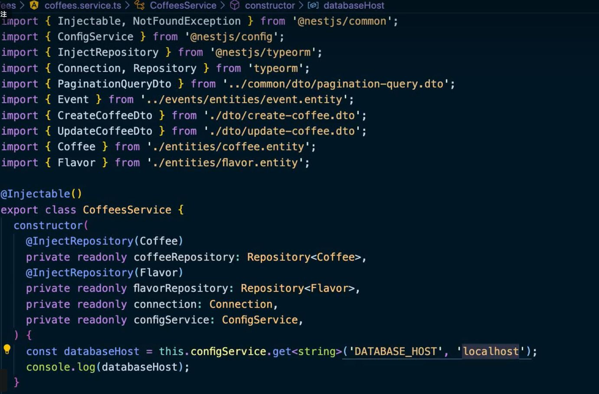
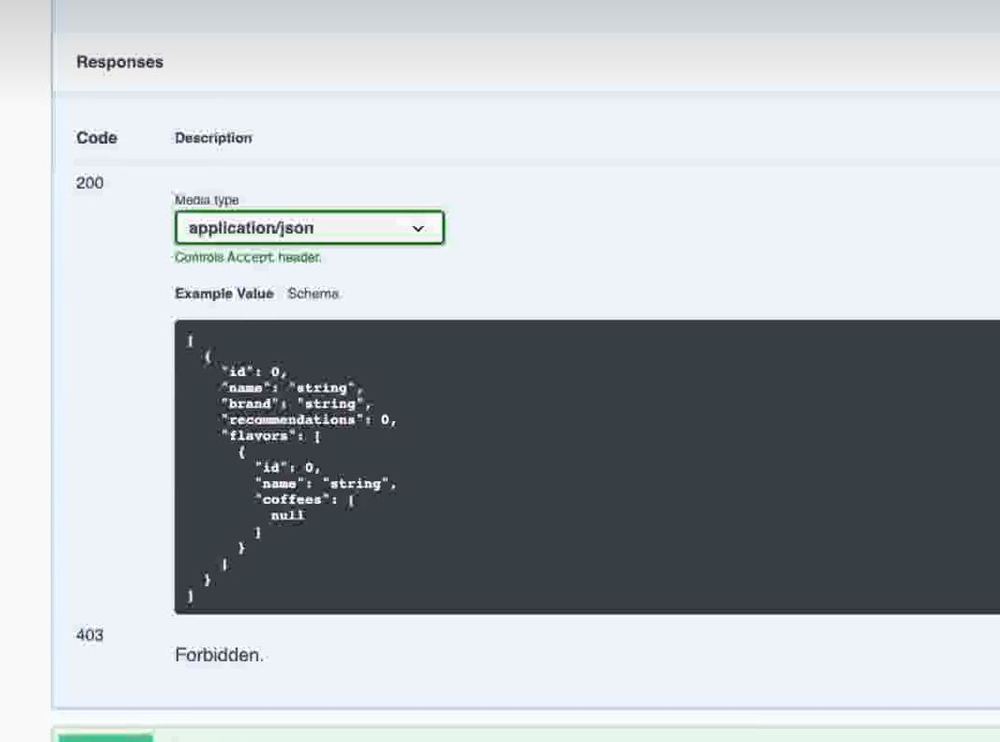

## start

- 启动服务，默认3000端口
	- `yarn start`
- 浏览器访问：<http://localhost:3000/>
	- 看到hello world
- 看下mian.ts的代码
	- 需要通过模块创建app
	- 
	- 这里利用ts的注解实现各个部分的关联

## create controller

- 创建控制器：`nest g co`
- 当前目录下会生成对应的目录，比如coffees
	- 
- 可以看到它包含控制器和测试用例
- 如果你不想生成测试用例，可以添加--no-spec参数`nest g co --no-spec`
- 查看app.module.ts，你会发现CoffeesController被加进去了：
	- 
- 

## @Get(subPath:string)

> - 请求方式的注解，你可以通过它声明要访问的子路径，或者指定要获取的参数等

### restful获取参数


你也可以只解析其中的一个属性
## @Post
支持post请求，和@get一样，可以获取参数，不过你需要利用@Body进行解析



## @HttpCode(code: number)

> 用来设置返回的http状态码


## @Res
你也可以通过@res拿到一整个相应，自定义返回码和头部等操作


## @Param(attr: string)
可以获取restful上面的url参数，和query还是不一样的

## @Query()
获取查询字符



## create service

> nest g s


## friendly exception

### HttpException

可以通过抛异常等方式，对响应进行处理


### NotFoundException
可以将HttpException处理的404更换为这个子类

### Throw
抛出错误的情况下，会变成默认的500异常


而且服务终端会有错误信息：


## module

### create module

> nest g m [module-name]


之前的coffees的controller和service都可以导入到coffee模块里面


## DTO

### create dto

> nest g class coffees/dto/create-coffee.dto --no-spec

会生成如下的dto


然后就可以替换到之前的controller


### validate

> install: `yarn add class-validator class-transformer` 

加上校验管道：

引入注解对字段进行校验：

发包如果少了字段，就会出现校验逻辑


对于部分字段的更新，由于update和create是类似的，所以updateDto可以沿用createDto


#### whitelist
支持白名单校验，即外部传入的多余字段，不会发到web服务内部

> 开启参数


> 然后发包添加冗余字段


> web内部已经拿不到jser了



#### forbidNonWhitelisted

> whitelist搭配forbidNonWhitelisted， 开启参数后，如果传递多了字段，web会报错


#### transform

> 默认情况下，拿到的dto并不是某个类的实例


> 可以开启transform:true的方式转成实例


> 那么transform还有什么作用么？


## Postgres

> 接下来要用上数据库，这里选择Postgres，基于docker环境运行

配置docker-compose.yml

```docker
version: "3"  
  
services:  
    db:  
        image: postgres  
        restart: always  
        ports:  
            - "5432:5432"  
        environment:  
            POSTGRES_PASSWORD: pass123
```

启动服务

```shell
docker-compose up -d
```


### TypeOrm

> 选择0.2.45的版本，不然官方教程可能会失效

> 配置连接db的参数


> 重启服务后你会看到如下日志，说明连接成功了

```shell
[Nest] 24276  - 08/24/2024, 1:05:09 PM     LOG [InstanceLoader] TypeOrmModule dependencies initialized +84ms

```

> 通过注解的方式，把表和实体关联起来

- @PrimaryGeneratedColumn：主键
- @Column：普通字段名，默认跟随当前key
- @Column("json", {nullable: true})：将引用类型序列化，比如数组之类的


> 最后把实体注入到module


> typeorm可以自动帮你把db的表，账号啥的都创建好，等你进入db的时候，你会发现啥都准备好了

可能是TypeoOrmModule.forRoot的时候synchronize设置导致的


> 当你插入一条数据


db就有对应的数据


再插入一条又有了


### Relationship between different entities

> coffee 和flavor是多对多的关系，一杯咖啡可以有多个风味，所以这里要创建关联

当你新增数据后，就会看到表被自动创建了


## pagination

> 创建分页

`nest g class common/dto/pagination-query.dto --no-spec`

然后你会得到一个用于分页的dto


> enableImplicitConversion可以废弃掉@Type注解的使用，通过ts推到字段的类型


> 把dto接入service和controller


> 然后你就看下分页的用法起作用了


## transaction

```typescript
import { Connection } from "typeorm"

const queryRunner = this.connection.createQueryRunner();
await queryRunner.connect();
await queryRunner.startTransaction();
try{
	await queryRunner.manager.save(data);
	await queryRunner.commitTransaction();
}catch(e){
	await queryRunner.rollback();
}finally{
	await queryRunner.release();
}
```

Index
```typescript
import {} Column, Entity, Index,PrimaryGeneratedColumn } from 'typeorm';
@Index(['name', 'type'])
@Entity()
export class Event {
	@PrimaryGeneratedColumn()
	id: number;
	@Column()
	type: string;
	
	@Index( )//这里加了索引
	@Column(
	name: string;
	@Column('json')
	payload: Record<string,any>
};
```

## database migration

 > ormconfig.js
 
 把前面的typeorm配置写道这里来

```javascript
module.exports = {
	type: "postgres",  
	host: "localhost",  
	port: 5432,  
	username: "postgres",  
	password: "pass123",  
	database: "postgres",  
	autoLoadEntities: true,  
	synchronize: true//生产环境记得禁用，这个会自动创建表
	cli: {//这里可以通过cli迁移数据库
		migrationDir: "src/migrations"
	}
}
```
> npx typeorm migration:create -n CoffeeRefactor

会生成一个：1724566043542-CoffeeRefactor.ts这类文件

> npx typeorm migration:run

这里会运行上面生成的文件

## 依赖注入

> @Injectable会把修饰的class当作provider


## useClass

```typescript
providers:[  
	CoffeesService,  
	provide: ConfgService,  
	useClass: process.env,NoDE ENV === 'development'? DevelopmentConfigService : Productionconfigservice,
]
```
## useFactory


## Dynamic Module


## Configuration

诸如数据库配置这类信息，通过process.env传递太繁琐，写死在应用内部也不安全，这种就需要通过配置文件解决

> 安装

`yarn install @nestjs/config`

> 创建配置文件.env.xxx


> ConfigModule.forRoot(options)默认情况下会在项目根目录进行查找

options:

```js
{
	envFilePath: "./enviroment",//指定配置文件
	ignoreEnvFile: true,//忽略.env文件
}
```


### validation

> 某些情况下，你需要对配置文件进行校验，这个时候可以借助第三方包进行检查

> yarn add @type@hapi_joi


### service



## @UsePipes


## Catch Exception

>nest g filter xxx


## Guard

类似拦截器的角色，处理权限，角色，ACL等逻辑

> nest g guard xxx

> 验证请求是否带有api令牌


 

### 检查请求访问的路径是否公开

>example 


> 自定义注解


> 守卫里面检查注解


## interceptors

> nest g interceptor xxx


### 处理超时


## 自定义管道

> nest g pipe xxx


## middleware

> nest g middleware


## 自定义修饰器


## swagger

> yarn add @nestjs/swagger swagger-ui-express


> 浏览器访问 http://localhost:3000/api/#/ 就可以看到文档了

### cli-nest引入插件


这样可以在swagger里面看到更详细的信息

### @ApiProperty


### @ApiResponse




### @ApiTags


## transaction

```typescript
import { Connection } from "typeorm"

const queryRunner = this.connection.createQueryRunner();
await queryRunner.connect();
await queryRunner.startTransaction();
try{
	await queryRunner.manager.save(data);
	await queryRunner.commitTransaction();
}catch(e){
	await queryRunner.rollback();
}finally{
	await queryRunner.release();
}
```

Index
```typescript
import {} Column, Entity, Index,PrimaryGeneratedColumn } from 'typeorm';
@Index(['name', 'type'])
@Entity()
export class Event {
	@PrimaryGeneratedColumn()
	id: number;
	@Column()
	type: string;
	
	@Index( )//这里加了索引
	@Column(
	name: string;
	@Column('json')
	payload: Record<string,any>
};
```

## database migration

 > ormconfig.js
 
 把前面的typeorm配置写道这里来

```javascript
module.exports = {
	type: "postgres",  
	host: "localhost",  
	port: 5432,  
	username: "postgres",  
	password: "pass123",  
	database: "postgres",  
	autoLoadEntities: true,  
	synchronize: true//生产环境记得禁用，这个会自动创建表
	cli: {//这里可以通过cli迁移数据库
		migrationDir: "src/migrations"
	}
}
```
> npx typeorm migration:create -n CoffeeRefactor

会生成一个：1724566043542-CoffeeRefactor.ts这类文件

> npx typeorm migration:run

这里会运行上面生成的文件

## 依赖注入

> @Injectable会把修饰的class当作provider


## useClass

```typescript
providers:[  
	CoffeesService,  
	provide: ConfgService,  
	useClass: process.env,NoDE ENV === 'development'? DevelopmentConfigService : Productionconfigservice,
]
```
## useFactory


## Dynamic Module


## Configuration

诸如数据库配置这类信息，通过process.env传递太繁琐，写死在应用内部也不安全，这种就需要通过配置文件解决

> 安装

`yarn install @nestjs/config`

> 创建配置文件.env.xxx


> ConfigModule.forRoot(options)默认情况下会在项目根目录进行查找

options:

```js
{
	envFilePath: "./enviroment",//指定配置文件
	ignoreEnvFile: true,//忽略.env文件
}
```


### validation

> 某些情况下，你需要对配置文件进行校验，这个时候可以借助第三方包进行检查

> yarn add @type@hapi_joi


### service


## @UsePipes


## Catch Exception

>nest g filter xxx


## Guard

类似拦截器的角色，处理权限，角色，ACL等逻辑

> nest g guard xxx

> 验证请求是否带有api令牌


 

### 检查请求访问的路径是否公开

>example 


> 自定义注解


> 守卫里面检查注解


## interceptors

> nest g interceptor xxx


### 处理超时


## 自定义管道

> nest g pipe xxx


## middleware

> nest g middleware


## 自定义修饰器


## swagger

> yarn add @nestjs/swagger swagger-ui-express


> 浏览器访问 http://localhost:3000/api/#/ 就可以看到文档了

### cli-nest引入插件


这样可以在swagger里面看到更详细的信息

### @ApiProperty


### @ApiResponse


### @ApiTags


