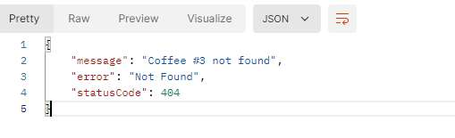

## start

- 启动服务，默认3000端口
	- `yarn start`
- 浏览器访问：<http://localhost:3000/>
	- 看到hello world
- 看下mian.ts的代码
	- 需要通过模块创建app
	- 
	- 这里利用ts的注解实现各个部分的关联

## create controller

- 创建控制器：`nest g co`
- 当前目录下会生成对应的目录，比如coffees
	- 
- 可以看到它包含控制器和测试用例
- 如果你不想生成测试用例，可以添加--no-spec参数`nest g co --no-spec`
- 查看app.module.ts，你会发现CoffeesController被加进去了：
	- 
- 

## @Get(subPath:string)

> - 请求方式的注解，你可以通过它声明要访问的子路径，或者指定要获取的参数等

### restful获取参数

你也可以只解析其中的一个属性
## @Post
支持post请求，和@get一样，可以获取参数，不过你需要利用@Body进行解析

## @HttpCode(code: number)

> 用来设置返回的http状态码

## @Res
你也可以通过@res拿到一整个相应，自定义返回码和头部等操作

## @Param(attr: string)
可以获取restful上面的url参数，和query还是不一样的

## @Query()
获取查询字符

## create service

> nest g s

## friendly exception

### HttpException

可以通过抛异常等方式，对响应进行处理

### NotFoundException
可以将HttpException处理的404更换为这个子类

### Throw
抛出错误的情况下，会变成默认的500异常

而且服务终端会有错误信息：

## module

### create module

> nest g m [module-name]

之前的coffees的controller和service都可以导入到coffee模块里面

